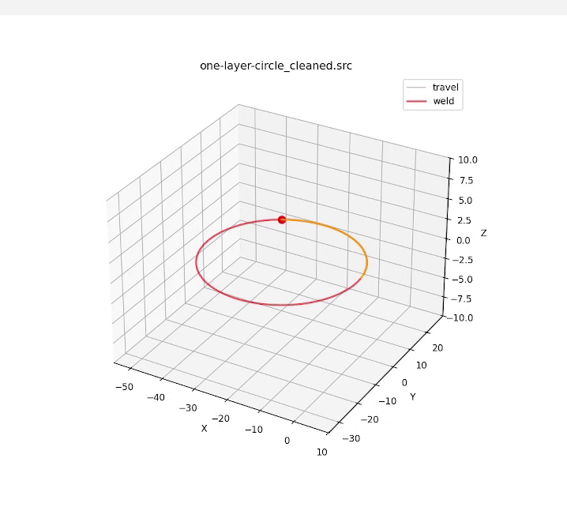

# G-code to KRL Workflow Instructions

This guide explains the full workflow for transforming standard G-code into KUKA KRL files, cleaning it, simulating the robot toolpath, and preparing files for upload to your KUKA controller.

---

## **1. Clean Your Raw G-code**

Run the G-code cleaner to remove duplicate points and zero distance points:

```bash
python ./gcode_cleaner.py your_gcode.gcode
```

This will generate:

```
your_gcode_cleaned.gcode
```

---

## **2. Transpile Cleaned G-code to KRL**

Convert the cleaned G-code into KUKA KRL `.src` and `.dat` program files:

```bash
python ./g_k_transpiler_clean.py your_gcode_cleaned.gcode
```

This produces:

```
your_gcode_cleaned.src
your_gcode_cleaned.dat
```

Upload both files to the robot controller (KRC4/KRC5) under `/R1/Program/`.

---

## **3. Visualize the Toolpath **

Generate an MP4 video showing the TCP motion from the generated KRL:

```bash
python ./visualize_toolpath.py your_gcode_cleaned.src
```

Use this to verify that the robot movement is smooth and collision-free.

---

## **Summary Workflow**

1. **Clean G-code** → `your_gcode_cleaned.gcode`
2. **Transpile to KRL** → `your_gcode_cleaned.src` + `your_gcode_cleaned.dat`
3. **Visualize Path** → `toolpath_visualization.mp4`
4. **Upload `.src` and `.dat` to robot** and run program.

---

## **4. Toolpath Visualization (GIF)**

You can embed the generated GIF preview directly in your README:

```markdown

```

Make sure the GIF is placed in the same directory as the README or update the path accordingly.

---


## **Config Bundle**
The description of the modified parameters as well as the reasons why can be found here: `https://waam.atlassian.net/wiki/spaces/WAAM/pages/142639105/Transpiler+Trajectory+Motion+Planning`

